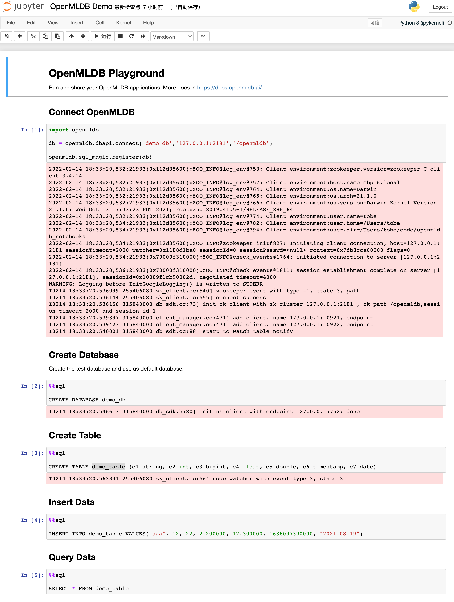

# Openmldb Notebooks

The collection of [OpenMLDB](https://github.com/4paradigm/openmldb) notebooks.



## Usage

Use the docker image [tobegit3hub/openmldb_notebooks](https://hub.docker.com/repository/docker/tobegit3hub/openmldb_notebooks).

```
docker run -it -p 8888:8888 tobegit3hub/openmldb_notebooks
```

Run with source code.

```
git clone https://github.com/tobegit3hub/openmldb_notebooks

cd ./openmldb_notebooks/notebooks/

ipython notebook
```
